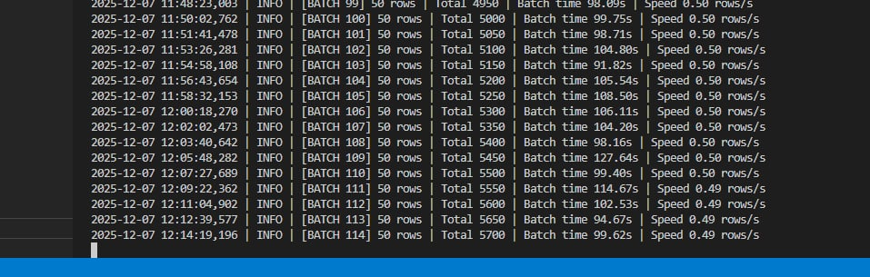
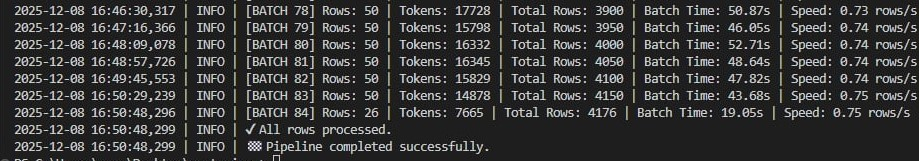

# Chunked Embeddings with Bielik (SQL + Python)

This page shows how chunked embeddings are produced with the Bielik-4.5B GGUF model and how to read the logs while it runs.

## End-to-end flow
- Chunk in SQL: `sql/SQL AI/003_generate_chunks.sql` uses `AI_GENERATE_CHUNKS` to slice `pubmed_article` rows into `pubmed_article_chunk`. It writes many rows and can run for a long time on lower-spec disks or CPUs.
- Vectorize in Python: `python/vectorizer/local_vector.py` pulls unprocessed chunks in batches and posts them to the Bielik embedding endpoint. The SELECT uses a join against `pubmed_article_chunk_vector` so already embedded ids are skipped; you can stop and restart the script at any time and it will continue where it left off.
- Persistence target: embeddings are inserted into `pubmed_article_chunk_vector` with a 1,998-dimension vector (PCA-trimmed Bielik output that fits SQL Server 2025 limits).
- Time-to-complete: both the SQL chunking step and the Python embedding step may take hours depending on your CPU, RAM, GPU, and disk bandwidth. Expect slower starts on CPU-only runs.
- Token volume and cost risk: embedding ~89k chunks (1,500 chars each) with Bielik consumed ~30,000,000 tokens. If you switch to an external paid model, remember most providers bill per 1,000 tokens. Small datasets are cheap, but larger can generate high costs quickly.

## Monitoring progress

- The logger shows batch number, rows processed, token totals, elapsed time per batch, and rolling throughput (rows per second). Use it to spot stalls, retries, or throughput changes while Bielik is embedding chunks.

## Completion signal

- When no more chunks satisfy the join (all ids already vectorized), the script exits after logging the final ready state shown above.

## Why later batches run faster (expected warm-up effects)
1) Model and library warm-up: early calls compile kernels, initialize graphs, and allocate CPU/GPU memory. Once compiled and cached, later calls skip that overhead.  
2) GPU utilization stabilizes: initial batches allocate VRAM and set up CUDA/ROCm streams; after streams and memory settle, fused kernels and tile sizes run more efficiently.  
3) Tokenizer and model caches: repeated or similar text benefits from tokenizer caches and reused buffers, cutting per-batch latency.  
4) Parallelism ramps up: thread pools and schedulers start sequentially but stabilize after thousands of rows, keeping CPU/GPU pipelines full.  
5) OS page cache: large model files are read once and then served from page cache, making weight access almost as fast as RAM.  
6) Thermal behavior: in some systems, clocks rise after a brief warm-up, which can further improve later batches.

**Takeaway:** the pipeline often speeds up after the first few batches because everything from CUDA kernels to tokenizer caches and OS page cache has been warmed, optimized, and stabilized. This is normal when vectorizing large datasets.